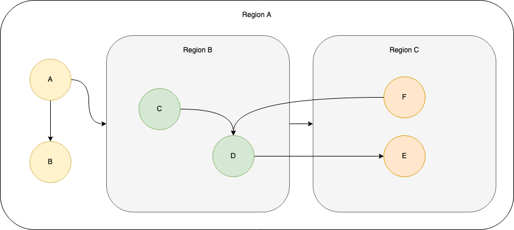
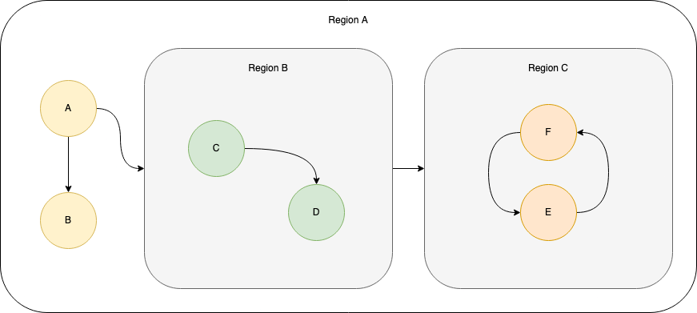
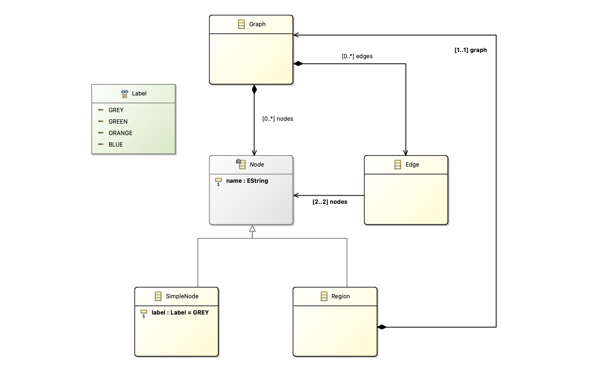
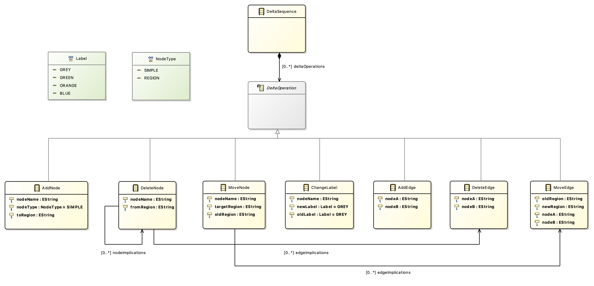

# graph-gentool

A generator for large models of hierarchical colored labeled graphs using the EMF. 

**Structure**

* Generator
  * Gradle Setup
  * Arguments
  * Output Structure
* Graph Metamodel
* Delta Metamodel 

## Generator

The graph generator is a Kotlin JVM application based on a Gradle build setup.
The sources are located under ``graph-gentool/``. The project is compilable and usable as executable JAR.

However, the most simple way to run the application is by using the gradle run command directly. We explain this in the next section.

### Gradle Setup

The following Gradle setup is the most easy way to use the graph-gentool. The setup was tested under following system conditions. Other setups may work as well.

* Gradle        8.4
* JVM           OpenJDK 21
* OS            Mac OS X 14.0 aarch64 (should have no influence)

Navigate in the project root directory (where the ``build.gradle`` file is located). 
To run the application, execute:

```
gradle run --args="./output_directory ...Arguments" 
```
For example ``gradle run --args="./out -s 512 -r 0.1 -p"``. You find the catalogue of possible arguments in the next section.

### Arguments

Short | Argument (--arg)| Default | Description
--- | --- | --- | ---
-- | *output directory*  | ``"./"`` |                Explicit first parameter. An existing or not existing directory Path in the form "a/b/c". If not existing, it will be created. If the directory contains a generated model set, same called files are overwritten.
``-s``|  ``model_size``     | ``1024`` |      Sum of nodes and edges in the generated base model (INT)
``-n``| ``edges_per_node``  | ``1.0`` |        Number of edge elements per node element (DOUBLE). This value influences edge_distortion and is influenced by allow_partitions.
``-d``| ``edge_distortion``   | ``0.0`` |      Probability 0...1 that an edge crosses region boundaries (DOUBLE). This value is influenced by allow_partitions.
``-r``| ``region_probability`` | ``0.0`` |   Probability 0...1 that a node is a region (DOUBLE).
``-p``| ``allow_partitions``  | ``unset`` |    Allow (set) or forbid (unset) the graph to have unconnected parts within a region and regions (1) (BOOL). This value influences edges_per_node.
``-c``| ``branch_number``    | ``0`` |     The number of branches (variants) to create from the final base model (INT).
``-l``| ``branch_edit_length`` | ``0`` |   (:ambulance: TODO) The number of additional edit operation performed on each branch (INT).
``-f``| ``branch_edit_focus``  | ``0.0`` |   (:ambulance: TODO) Probability factor 0..1 that the next edit operation happens in the same region as the previous. A value of 0.0 results in an evenly distribution over all regions.
``-e`` | ``atomic_counting`` | ``false`` | (:ambulance: TODO) Toggle, how the edit length is counted. ``true`` for atomic counting and ``false`` for accumulative counting. If ``true``, the resulting edit sequence will have exactly the same size as specified by the branch edit length. If ``false``, the number of explicit (high-level) edits is counted (although writing the atomic edits to the edit sequence). For example, let there be a region R containing 3 nodes and 2 edges. If ``delete R`` is the edit.  If R gets deleted, its composite contents must be deleted as well. The result are 6 atomic edits which are added to the edit sequence (one explicit edit and 5 implicit edits). If atomic counting is used, the counter increments by 6. If no atomic counting is used, the counter increments by 1.


**(1) Connectedness** 

In general, a graph has partitions if two or more subgraphs without connecting edges can be identified. In the case of the graph-gentool, we use stricter definition of connectedness to improve computation complexity: Edges between nodes of different regions are not traversed to check for partitions. Consequently, a graph has no partitions if the each sub-graph has no partition ignoring incoming and outgoing edges AND the set of regions form a composite structure (true by construction).

Example: The first figure shows a graph (as it could be generated by this tool) with has partitions according to our definition. All nodes in Region A (A, B, Region B, Region C) are connected. However, nodes E and F have no connection within Region C. Therefore, the they are considered partitions.

In the second figure, E and F are connected within Region C. Therefore, the graph has no partitions.

<style>
td, th {
   border: none!important;
}
</style>


|   |   |
|---|---|
|  |  |

### Output Structure

The specified output directory is populated as follows:

* model.labelgraph
* model.graphdelta
* b_[0...branch_number-1]
  * model.labelgraph
  * model.graphdelta

The toplevel model is the base model (root graph) and the delta sequence to create it.
The branch-level models contain the edited branches (variants). The branch-level delta sequence contains the edit steps from the base to the final model.

## Graph Metamodel

The graph-gentool generates graphs following a custom metamodel. The Ecore representation is shown in the figure. The Ecore files are located under ``metamodel/labelgraph``.

The graph has the following properties:
* A Graph contains a set of Nodes and a set of Edges.
* Each Node has a name.
* An Edge connects two Nodes. The Edge has no semantics. However, the connected Nodes are ordered. 
* Each Node is either a SimpleNode or a Region.
* A SimpleNode has a label (color) out of a finite set of labels. The concrete Metamodel knows four different labels (colors).
* A Region is a Node that contains a Graph. We call it a Sub-Graph.
* An Edge can connect Nodes out of different Sub-Graphs (Cross-Hierarchy). We call such an Edge *distorted*. An Edge is posessed by the (Sub-)Graph where its first Node is located in.



**Implementation Details**

The implemented construction algorithm has certain consequences on the graph structure:
* Starting from the root, the regions are initially organized to form a tree.
  * Edge additions (having more edges as required) may lead to cyclic connected regions within the level of a common parent region.
  * If the edge distortion probability is 0.0, regions do not have cross-hierarchy cycles.
  * SimpleNodes are distributed evenly over all regions
  * Regions are distributed according to the region distribution algorithm

**Region DIstribution**

1. Define the two sets *Distributed* and *NotDistributed*
2. Construct all regions and add them to the *NotDistributed* set.
3. Pick one Region as the root Region; Link it as the graph root; Move it from *NotDistributed* to *Distributed*
4. While *NotDistributed* is not empty:
   1. Take and remove a Region from *NotDistributed*
   2. Link it as child of a random Region from *Distributed*
   3. Add it to *Distributed*

This leads to a tree composite hierarchy. Regions closer to the root contain (have a higher probability of) more direct child regions as Regions farer away from the root.

## Delta Metamodel



**Example**

```XML
<?xml version="1.0" encoding="UTF-8"?>
<graphdelta:DeltaSequence xmi:version="2.0" xmlns:xmi="http://www.omg.org/XMI" xmlns:xsi="http://www.w3.org/2001/XMLSchema-instance" xmlns:graphdelta="http://st.tud.de/graphdelta">
  <deltaOperations xsi:type="graphdelta:AddNode" nodeName="N1" toRegion=""/>
  <deltaOperations xsi:type="graphdelta:AddNode" nodeName="N2" toRegion=""/>
  <deltaOperations xsi:type="graphdelta:AddEdge" nodeA="N1" nodeB="N2"/>
  <deltaOperations xsi:type="graphdelta:DeleteEdge" nodeA="N1" nodeB="N2"/>
  <deltaOperations xsi:type="graphdelta:DeleteNode" fromRegion="" edgeImplications="//@deltaOperations.3" nodeName="N1"/>
</graphdelta:DeltaSequence>
```